[简体中文](./README.zh-cn.md)

# Screenshots

for members ( who subscribe the plan )


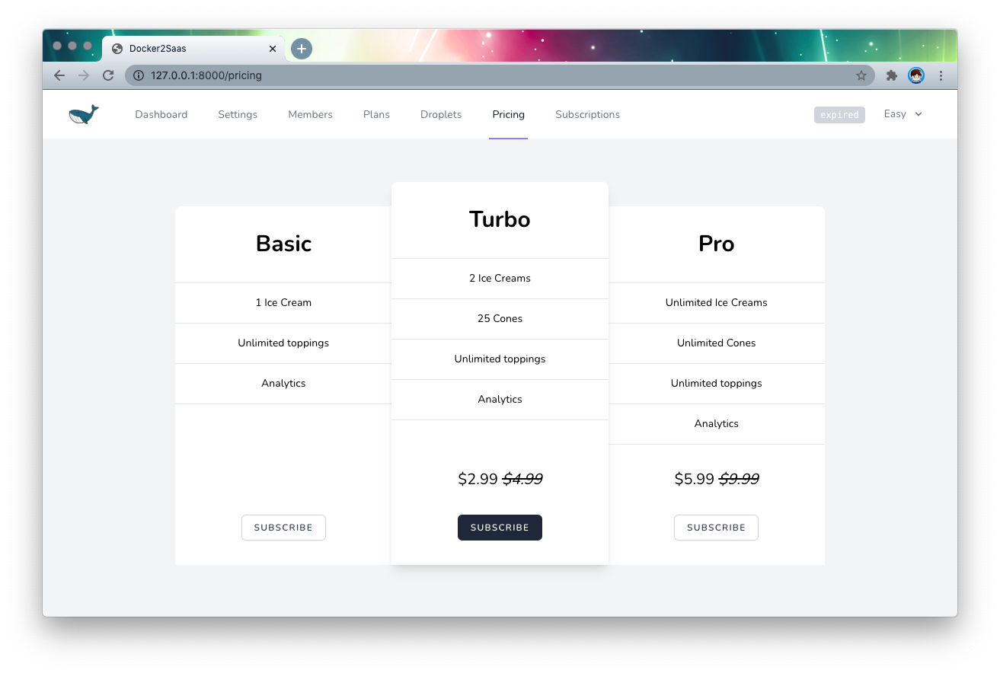
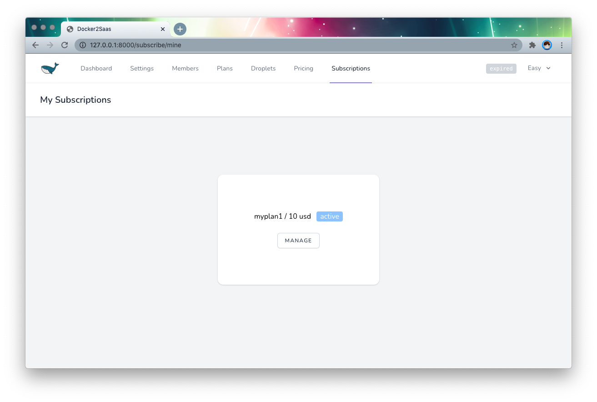

for admin

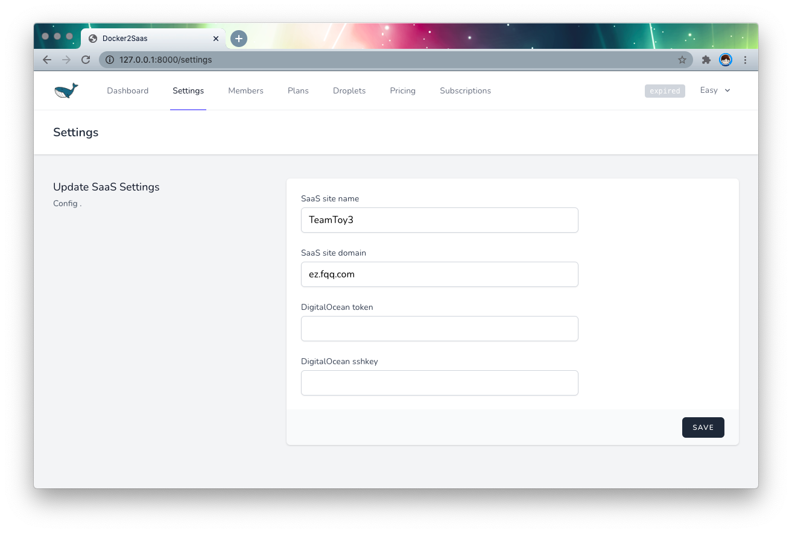

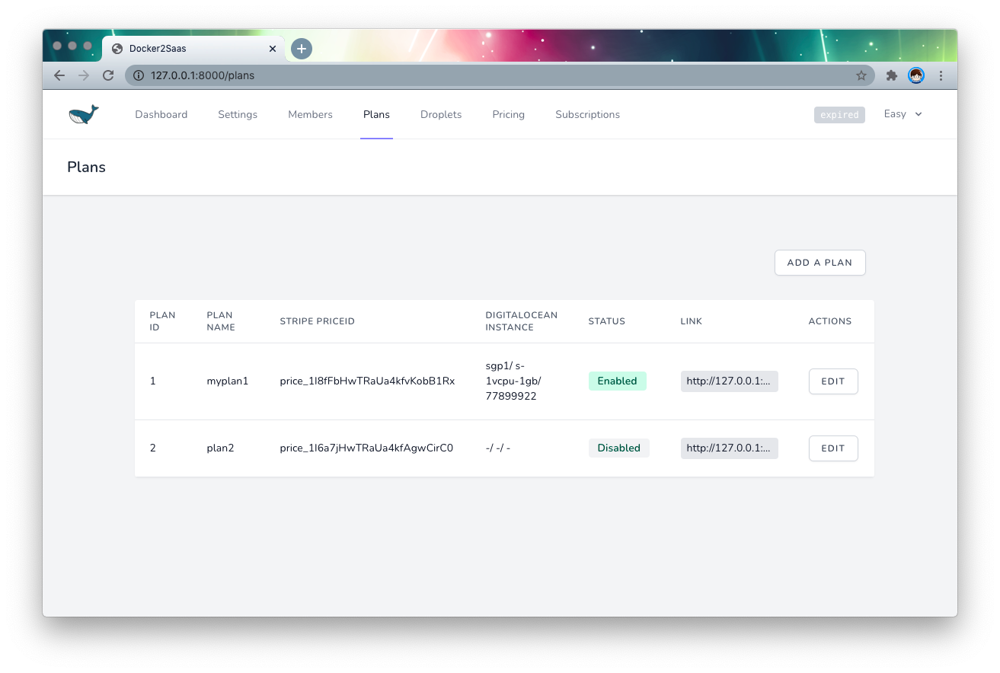
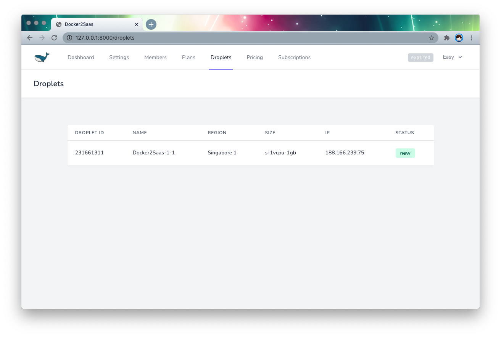


⚠️ This document was translated into English by deepl and can be improved by PR

> An open source tool that lets you create SaaS websites from images in as
little as 10 minutes.

Docker2SaaS is a tool that enables multi-tenancy through virtualization
technology (calling cloud platform api ) with tenant management and subscription
managment.  It helps web application and service developers to quickly build
websites for sale or subscription. All you need to do is make an image of your application and
then set up and configure a Docker2SaaS site to start selling your application as a service.

When a user's subscription is successful, it automatically creates a VPS from
the image as configured; when the user cancels the subscription and it expires,
it automatically deletes the VPS. Users can login to the site and see their
subscription, host IP information, and other details. Additional extentsions can be
added.

The diagram below shows how Docker2SaaS interacts between:
End Users  
Payment provider: Stripe 
Cloud service provider: DigitalOcean.

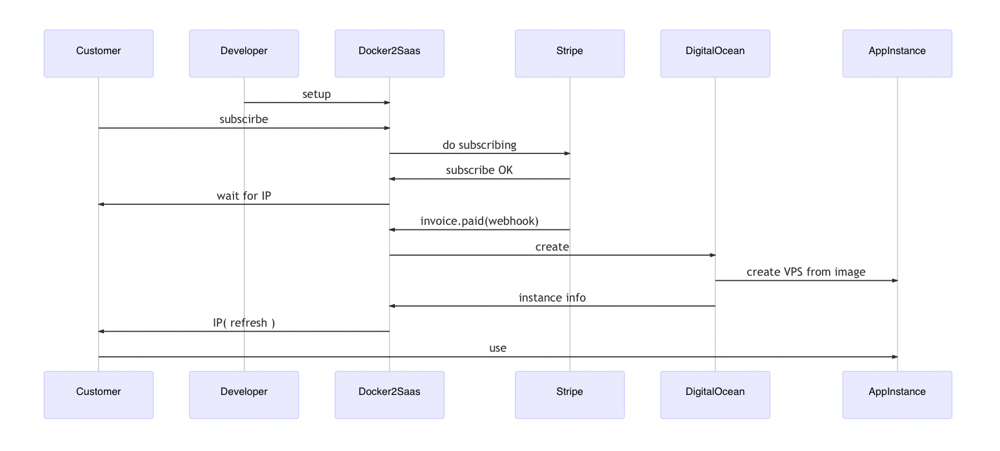

# Target Users of Docker2SaaS

Docker2SaaS is aimed at developers of cloud applications, providing them with a
solution to quickly monetize their applications.

Let's say you develop a nice little web app and open source it to Github.
Developers easily build it and use it on their own, but as the app becomes more
popular, so do non-technical users. But even if they have already made a docker
file, it is still difficult for them.

At this point you may want to provide a cloud hosting version. On the one hand,
you can solve the details of the build for non-technical users, and on the other
hand, hosting can bring some profit, so you can get a financial return.

However, this can create an additional amount of development, and it doesn't
seem wise to spend weeks on development before you know if cloud hosting will be
popular.

Fortunately, the open source Docker2SaaS solves this problem, and it only takes
ten minutes to configure and you can get a simple and usable cloud hosting sales
site. It's **immediately ready for early sales**, and you can modify the source code
to add more business-related features as user demand increases. 

Of course, it can also be used to build a third-party sales site under the
license of a cloud application developer. But overall, Docker2SaaS is designed
for developers and does not take into account the experience of non-technical
users, so if you don't have a technical background, it's better to use a
Docker2SaaS site that someone else has built rather than building it yourself.

PS: Docker2SaaS is built on Laravel, and while no knowledge is required for a
simple deployment, if you want to customize and add features, then you need to
have a little Laravel development knowledge.

Docker2Saas is licensed under the GPLv2 with an additional non-compete clause. 

## Docker2SaaS Guide

## Steps

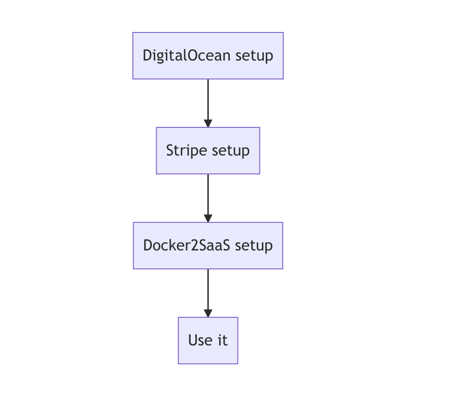

## Digital Ocean configuration 
### Create a Digital Ocean image 
We assume that you have already made a docker image of your application and can start it with the docker-compose command. Let's use Ghost as an example to explain.

First we will create a droplet（ Digital Ocean calls its VPS droplet  ） on Digital Ocean and select `docker on ubuntu` under `marketplace`.


Then we log in to the newly created instance via SSH. Create our docker-compose.yaml file in the root directory (or somewhere else). Here we use the yaml provided by bitnami.

```yml

version: '2'
services:
  mariadb:
    restart: always
    image: 'docker.io/bitnami/mariadb:10.3-debian-10'
    environment:
      - ALLOW_EMPTY_PASSWORD=yes
      - MARIADB_USER=bn_ghost
      - MARIADB_DATABASE=bitnami_ghost
    volumes:
      - 'mariadb_data:/bitnami'
  ghost:
    restart: always
    image: 'docker.io/bitnami/ghost:3-debian-10'
    environment:
      - MARIADB_HOST=mariadb
      - MARIADB_PORT_NUMBER=3306
      - GHOST_DATABASE_USER=bn_ghost
      - GHOST_DATABASE_NAME=bitnami_ghost
      - ALLOW_EMPTY_PASSWORD=yes
      - GHOST_HOST=localhost
      - GHOST_EMAIL=guest@ftqq.com
      - GHOST_PASSWORD=admin
    ports:
      - '80:2368'
    volumes:
      - 'ghost_data:/bitnami'
    depends_on:
      - mariadb
volumes:
  mariadb_data:
    driver: local
  ghost_data:
    driver: local
```
Note that we have added `restart: always` to ensure that docker is started automatically when the image is started.

Once the file is created, go to droplet management and create a snapshot.


When you are done creating the snapshot, you can delete the droplet instance.

Go to the images page and look up the data-id of the snapshot in the source code corresponding to the snapshot entry you just created, this value (78661121 in the image) is the id of the snapshot. Record it, and we'll use it later. (We'll call this A1)

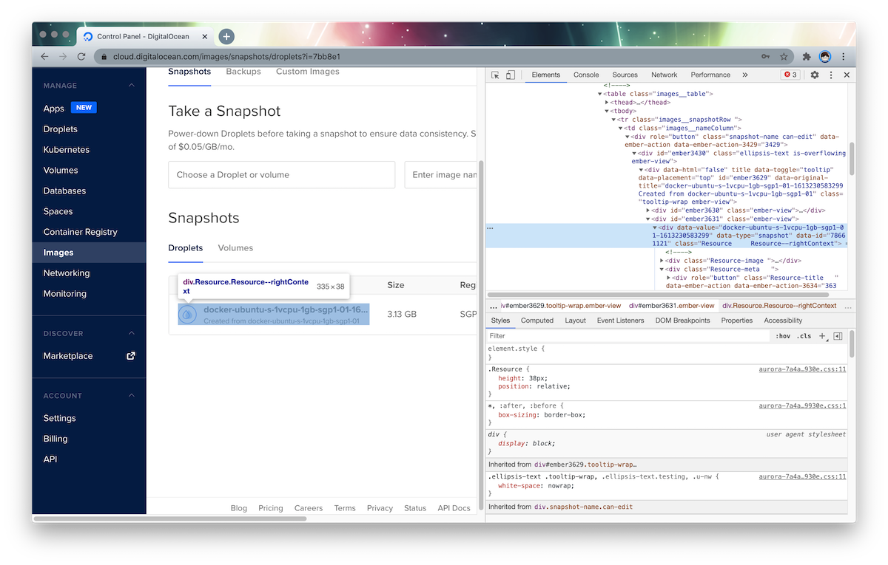

### Creating a Digital Ocean Token

Next we will create a token so that we can manage droplet through the API. At the bottom of the left menu, select API. 


In the Tokens/Keys tab, generate a new token with the read && write permissions selected.
Once generated, record it and you will need it later. (We'll call it A2)

## Stripe Configuration
The following are all described in Test mode. 

### Create a subscription
Go to the Stripe dashboard and create a [product](https://dashboard.stripe.com/test/products/create).

Note that in the Pricing section, select Recurring so that it will automatically renew. Fill in the rest of the fields as you wish.

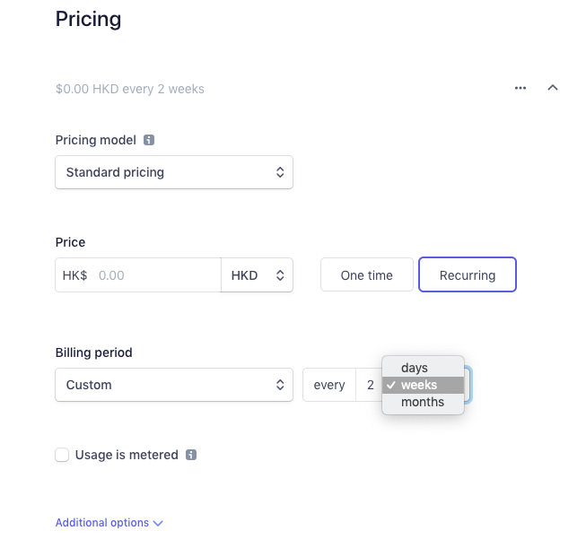
After creating the product, go to the product details page, and you can see the API ID in the Pricing section, and record it. (We'll write it down as B1)


You can create as many prices as you need, remember to record the price ids.

### Get API key
In order to interact with the Stripe platform through the API, we also need the API key. click the Developer menu on the left, select API Keys, and record the publishable key and secret key on the right. (Note B2, B3)


Since then, the preparation is done.

## Configuring Docker2SaaS


### Site initialization

Download/clone the docker2saas source code to the environment where you want to run the sales site. This environment needs to be configured with PHP7.4+ and MySQL.

```bash
git clone https://gitlab.com/easychen/docker-2-saas.git --depth=1 docker2saas
```

Initialization of dependency packages：

```bash
cd docker2saas 
composer install
```

Rename `.env.example` to `.env` and run the command to generate APP_KEY

```bash
php artisan key:generate
```

Fill in other relevant information.

1. APP_DEBUG : should be set to false after debugging is completed 
2. APP_URL : Website URL
3. APP_LOGO_URL and APP_ICON_URL: Home page big picture and top menu icon
4. DB_*: database related configuration
5. STRIPE_KEY: the B2 in the previous article
6. STRIPE_SECRET: B3 in the previous section

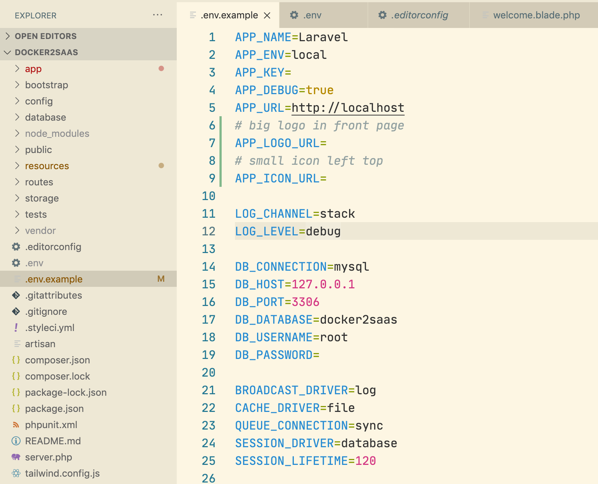

After creating the database docker2saas in MySQL, then run the command to initialize the database.

```bash
php artisan migrate
```
Start the development environment

```bash
php artisan serve --host=0.0.0.0 --port=8001
```

You can see the website by accessing port 8001 of the machine ip. Click register to register users and login automatically, the first registered user will become administrator automatically.

The administrator's logic can be modified in `app/Providers/AuthServiceProvider.php`.

```php
Gate::define('saas-admin', function (User $user) {
            return $user->id == 1;         
});
```

### Configure the site

Click on the settings tab to configure the basic information for the site, where `DigitalOcean token` is A2 from above.

The `DigitalOcean sshkey` is the public key you want to use to manage all droplets. if you don't have one ready, you can create one by running the following command.

```bash
ssh-keygen -t rsa  -f <name>
```
During the run, if you don't want to set the passphrase, you can just press enter twice to set it to empty.

```
ssh-keygen -t rsa  -f this
Generating public/private rsa key pair.
Enter passphrase (empty for no passphrase): 
Enter same passphrase again: 

```

When this is done, <name>.pub will be generated in the command directory, and its contents will be the sshkey we want to fill in the form.


### Create a subscription plan

Click `Add a plan` on the `Plans` page to add a subscription plan.


1. Name: the name of the plan visible to the user, e.g. pro
2. Stripe Price ID: B1 in the previous article
3. DigitalOcean Droplet Region: the region where the created cloud host is located 
4. DigitalOcean Droplet Size: the model of the created cloud host

The region and size values can be obtained from the Digital Ocean official website on the Create Droplet page. After you have selected the desired region and model, the default name of the generated cloud host is the size in the selected section as shown below, followed by the `sgp1` section which is the region.

1. DigitalOcean Droplet Image: A1 in the previous section
2. DigitalOcean Droplet User Data: Custom information that can be accessed in the cloud host, which can be used to pass information about the purchased user, such as email, etc. The details of what is used will be explained later. You can leave it blank for now.


After saving, you will get a Link in the list screen, which you can click to enter the subscription process of the plan. (This link is called C1)

Click on the `Pricing` page to see a preset plan display page.

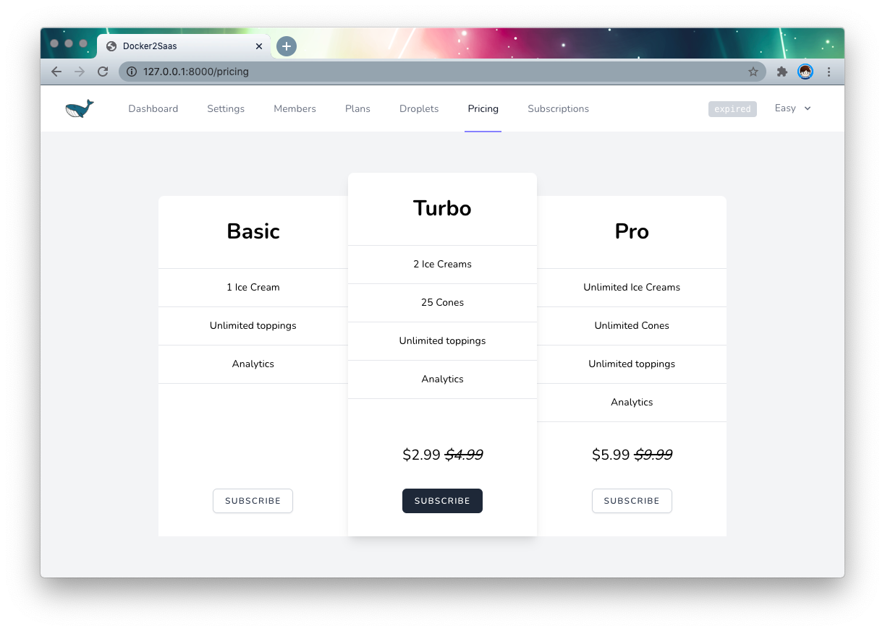
This page can be customized by editing `resources/views/pricing.blade.php`. This page uses the [blade](https://laravel.com/docs/8.x/blade) syntax, but is composed almost entirely of HTML, so it is not too difficult to modify.

In addition to modifying the style and service offerings, you should pay special attention to the `Subscribe` button below, which should link to the corresponding plan, as in C1 above.

Similarly, edit `resources/views/dashboard.blade.php` to modify the `dashboard` page that users see after registering, where you can add instructions and help related to the cloud service.

### Other configuration items

#### Timed tasks

Docker2Saas monitors expired users daily and removes their cloud hosts. To be able to execute it regularly, you need to add the commands for this item to the system crontab:. macos/deepLFree.translatedWithDeepL.text

```
* * * * * php </path/to/docker2saas>/artisan schedule:run
```

#### Webhook
Since users can modify their subscriptions on the Stripe website, subscription modifications and payment confirmations in Docker2Saas are done via webhook.

The webhook requires an externally accessible URL, which is recommended to be configured after going live. If you are debugging locally, you can use ngrok for intranet penetration.

Suppose the URL of Docker2Saas website is `http://D.com`, then the webhook endpoint URL is `http://D.com/stripe/webhook`.


Select the following events at events to send.

1. invoice.created
2. invoice.paid
3. invoice.payment_action_required
4. customer.subscription.created
5. customer.subscription.updated
6. customer.subscription.deleted
7. customer.created
8. customer.updated
9. customer.deleted

Note that the `customer.subscription.updated` is a subscription change, which is not handled by default as it involves the specific hierarchy logic behind the cloud application. You can implement it yourself in `app/Http/Controllers/WebhookController.php`.

At this point, the site is ready for normal transactions. Note that here we are using develop server for debugging, and in order to support more users, you should switch to dedicated server software such as Nginx. For details, please [refer here](https://laravel.com/docs/8.x/deployment).

#### Initializing a mirror using user data

In a Ghost mirror, we need to know the IP address or domain name of the current droplet to configure the connection path; we also need to know the email address of the user to create a default account for them.

So we need a way to get user information in the mirror. When creating the plan above, we have a user data option (noted as F1) that is used to do just that.


This is a mechanism [provided by Digital Ocean](https://www.digitalocean.com/docs/droplets/how-to/provide-user-data/), in all droplets, just visit `http:// 169.254.169.254/metadata/v1/user-data` to get the information passed in during creation.

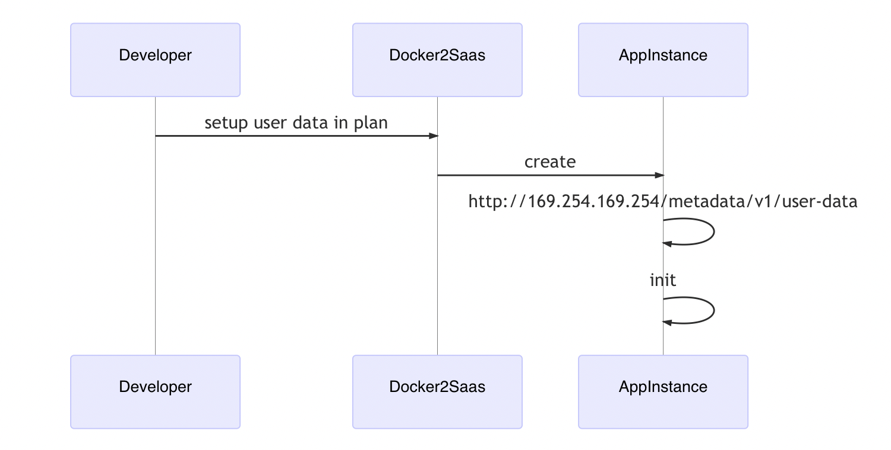

You can view it in droplet with the curl command.

```bash
curl http://169.254.169.254/metadata/v1/user-data
```
But there is a problem that each user has a different email address. So we need to have variables to support when we fill in the F1 place. Here Docker2Saas provides `$user` variables via the blade syntax, so you can insert the user id via `{{$user->id}}` and the email via `{{$user->email}}`.

```
uid={{$user->id}}
```

You can even put the `docker-compose.yml` template directly at F1.

Of course, in the droplet image, you also need to configure the appropriate startup script to get this data and configure it.

In addition, through `curl http://169.254.169.254/metadata/v1` you can also get droplet related information, such as ip, domain name, etc. For the specific format, please refer to the [related documentation](https://www.digitalocean.com/docs/droplets/how-to/retrieve-droplet-metadata/).


# License

This project uses the GPLv2 License with conditions.

Both individuals and commercial companies can use Docker2SaaS to build their own cloud application sales sites under the GPLv2 license.

However, selling Docker2SaaS itself as a Cloud Hosting service (e.g., making Docker2SaaS an image and selling it as a cloud service through Docker2SaaS or other platforms) is prohibited.


 
