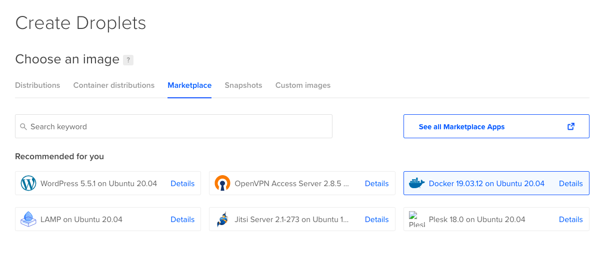
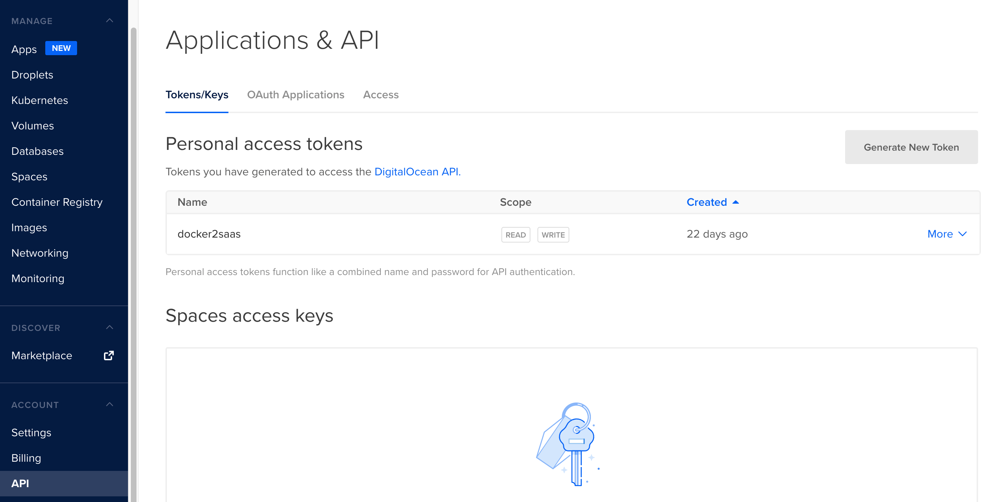
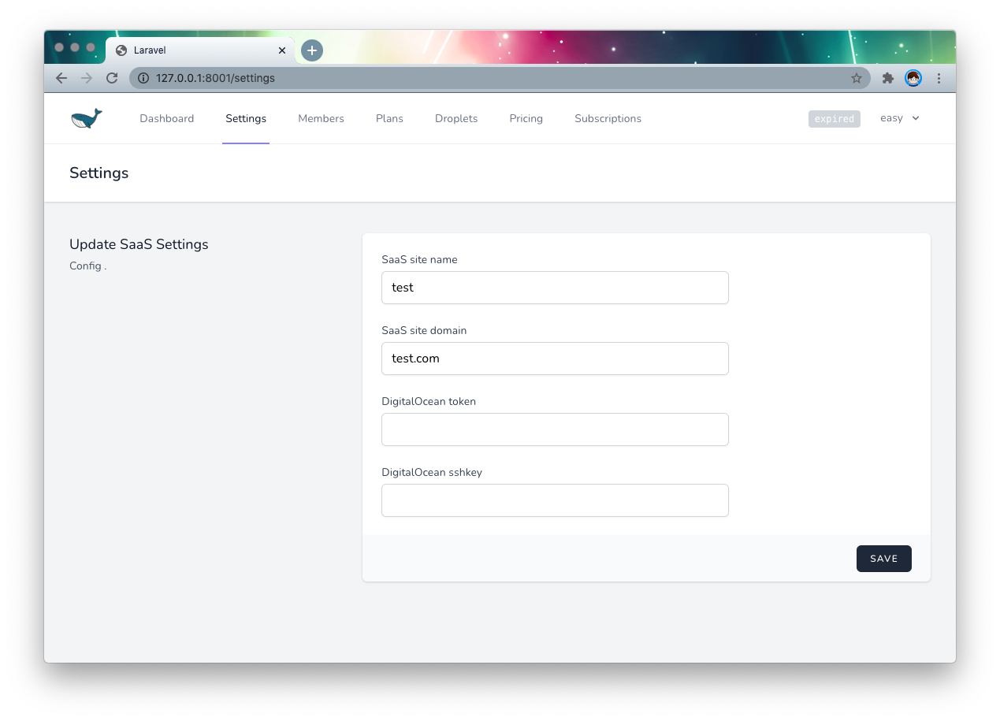
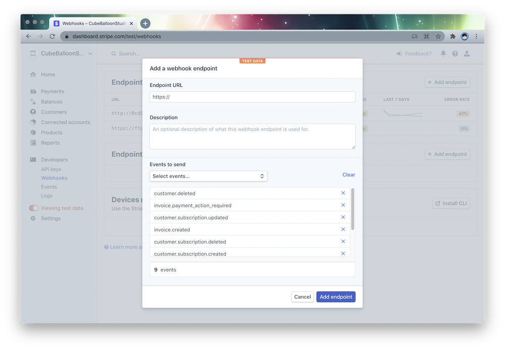

[English](./README.md)

# 什么是 Docker2SaaS

> 一个让你只需要花 10 分钟就可以从镜像创建 SaaS 网站的开源工具。

Docker2SaaS 是一个帮助 Web 应用和服务开发者快速建立销售用网站的开源工具。你只需要将自己开发的应用制作成镜像，然后架设并配置一个 Docker2SaaS 网站，就可以开始销售云应用。

当用户订阅成功，它会按配置自动从镜像创建一个 VPS 为其服务；当用户取消订阅并过期后，它会自动删除 VPS。用户登入网站后可以看到自己的订阅、主机的 IP 信息。当然，你还可以添加更多，因为它是开源的。

下边的图展示了 Docker2SaaS 是如何在客户、支付服务商 Stripe 和 云服务提供商 DigitalOcean 之间进行交互的。


# Docker2SaaS 的目标用户

Docker2SaaS 主要面向云应用的开发者，为其提供一个迅速将应用变现的解决方案。

假设你开发了一个好用的 Web 小应用，并将其开源到了 Github。一些开发者很容易的自行搭建并使用了起来，但随着这个应用越来越受欢迎，非技术用户也开始变多。但是即使是已经制作了 docker file，对他们来讲，难度依然不小。

这时候你可能想提供 cloud hosting 的版本。一方面可以解决非技术用户在搭建上的细节问题，另一方面，hosting 可以带来一些利润，让你获得财务上的回报。

但这会带来额外的开发量，在你尚不知道 cloud hosting 是否受欢迎之前，花上几周时间来开发似乎并不是明智之举。

幸好，开源的 Docker2SaaS 可以解决这个问题，只需要花十分钟进行配置，你就可以得到一个简单但可用的 cloud hosting 销售网站。通过它立刻就可以进行早期的销售；当用户的需求增加后，你还可以修改源码添加更多的业务相关功能。 

当然，它也可以被用来在云应用开发方许可下搭建第三方销售用网站。但整体而言，Docker2SaaS 是面向开发者设计的产品，并未考虑非技术用户的体验，如果您没有技术背景，那么更好的选择是使用别人搭建完成的 Docker2SaaS 网站，而非自己来搭建。

PS：Docker2SaaS 是基于 Laravel 构建的，虽然简单的搭建无需相关知识，但如果你要进行定制和添加功能，那么则需要具备一点 Laravel 开发常识。

# Docker2SaaS 搭建指南

## 主要步骤


## Digital Ocean 配置 
### 创建 Digital Ocean 镜像 
我们假设你已经将应用做成 docker 镜像，并可以通过  docker-compose 命令启动。下边我们以 Ghost 为例，来进行讲解。

首先我们在 Digital Ocean 上创建一个 droplet。镜像选择 `marketplace` 下的 `docker on ubuntu`。



然后我们通过 SSH 登入到新创建的实例里边。在根目录下（或者其他地方）创建我们的 docker-compose.yaml 文件。这里我们使用 bitnami 提供的 yaml。

```yml

version: '2'
services:
  mariadb:
    restart: always
    image: 'docker.io/bitnami/mariadb:10.3-debian-10'
    environment:
      - ALLOW_EMPTY_PASSWORD=yes
      - MARIADB_USER=bn_ghost
      - MARIADB_DATABASE=bitnami_ghost
    volumes:
      - 'mariadb_data:/bitnami'
  ghost:
    restart: always
    image: 'docker.io/bitnami/ghost:3-debian-10'
    environment:
      - MARIADB_HOST=mariadb
      - MARIADB_PORT_NUMBER=3306
      - GHOST_DATABASE_USER=bn_ghost
      - GHOST_DATABASE_NAME=bitnami_ghost
      - ALLOW_EMPTY_PASSWORD=yes
      - GHOST_HOST=localhost
      - GHOST_EMAIL=guest@ftqq.com
      - GHOST_PASSWORD=admin
    ports:
      - '80:2368'
    volumes:
      - 'ghost_data:/bitnami'
    depends_on:
      - mariadb
volumes:
  mariadb_data:
    driver: local
  ghost_data:
    driver: local
```
需要注意的是，这里我们添加了 `restart: always`，以保证镜像启动的时候会自动启动 docker。

文件创建完成后，进入 droplet 管理创建一个 snapshot。


创建完成以后可以把 droplet 实例删除了。

进入 images 页面，在刚创建的 snapshot 条目对应的源代码中，查找到它的 data-id ，这个值（图中是 78661121 ）就是 snapshot 的 id。知道了它，我们就可以把从这个  snapshot 创建 droplet 了。把它记录下来，之后会用到。（我们称其为 A1）


### 创建 Digital Ocean Token

下边我们来创建一个 token，这样才能通过 API 管理 droplet 。在左侧菜单最下方，选择 API。
在 Tokens/Keys tab， 生成一个新的 token。注意要选择 read && write 权限。
生成好以后把它记录下来，之后会用到。（我们称其为 A2）

## Stripe 配置
以下均以 Test mode 进行说明。 
### 创建订阅
进入 Stripe dashboard，创建一个 [product](https://dashboard.stripe.com/test/products/create)。

注意在 Pricing 部分，选择 Recurring ，这样才能自动续费。其他的项按自己的需求填写即可。


创建完成后，进入该 product 详情页面，可以看到  Pricing 一节中的 API ID，将其记录下来。（我们记为 B1 ）


根据自己的需要，可创建多个 price ，记得把 price id 都记录下来。

### 获得 API key
为了能通过 API 和 Stripe 平台交互，我们同样需要 API key。点击左侧的 Developer 菜单，选择 API Keys，把右侧的 publishable key 和 secret key 记录下来。（记为 B2，B3）


自此，准备工作就完成了。

## 配置 Docker2SaaS


### 网站初始化

将 docker2saas 的源代码下载/clone 到要运行销售网站的环境。该环境需要配置好 PHP7.4+ 和 MySQL 。

```bash
git clone https://gitlab.com/easychen/docker-2-saas.git --depth=1 docker2saas
```

初始化依赖包：

```bash
cd docker2saas && composer install
```

将 `.env.example` 改名为 `.env` ，并运行命令生成 APP_KEY

```bash
php artisan key:generate
```

填写其他相关信息：

1. APP_DEBUG : 调试完成后应设置为 false 
2. APP_URL：网站网址
3. APP_LOGO_URL 和 APP_ICON_URL：首页大图和顶部菜单图标
4. DB_*：数据库相关配置
5. STRIPE_KEY：前文中的 B2
6. STRIPE_SECRET：前文中的 B3


在 MySQL 中创建数据库 docker2saas 后，然后运行命令初始化数据库：

```bash
php artisan migrate
```
启动测试环境

```bash
php artisan serve --host=0.0.0.0 --port=8001
```

访问机器 ip 的 8001 端口即可看到网站。点击 register 注册用户并自动登录，第一个注册的用户将自动成为管理员。

管理员的判断逻辑可自行在 `app/Providers/AuthServiceProvider.php` 中修改：

```php
Gate::define('saas-admin', function (User $user) {
            return $user->id == 1;         
});
```

### 配置网站
点击 settings tab，配置网站的基本信息，其中 `DigitalOcean token` 为上文中的 A2。
`DigitalOcean sshkey`  是你想要用来管理所有 droplet 的 public key。如果你没有准备好的，可以运行以下命令创建：

```bash
ssh-keygen -t rsa  -f <name>
```
运行过程中，如果你不想设置 passphrase ，可以直接按两次 enter 将其设置为空。

```
ssh-keygen -t rsa  -f this
Generating public/private rsa key pair.
Enter passphrase (empty for no passphrase): 
Enter same passphrase again: 

```

完成后，在命令目录下会生成 <name>.pub ，其内容就是我们要填写到表单中的 sshkey。





### 创建订阅计划

点击 `Plans` 页面的 `Add a plan` 来添加订阅计划：


1. Name：用户可见的计划名称，比如 pro
2. Stripe Price ID：前文中的 B1
3. DigitalOcean Droplet Region：创建的云主机所在区域 
4. DigitalOcean Droplet Size：创建的云主机的型号

region 和 size 的值可以在 Digital Ocean 官网创建 droplet 页面获得，当你选择好需要的区域和型号后，在生成云主机的默认名称中，如下图选中部分即为 size，其后的 `sgp1` 部分即为 region。

1. DigitalOcean Droplet Image：前文中的 A1
2. DigitalOcean Droplet User Data：在云主机中可以访问到的自定义信息，可以传递购买用户的信息，如 email 等，具体用到什么地方，后文会做讲解。可暂时留空。


保存以后，可以在列表界面得到一个 Link，用户点击该链接即可进入计划的订阅流程。（此链接记为 C1）

点击 `Pricing` 页面，可以看到一个预设的计划展示页面。


编辑 `resources/views/pricing.blade.php`  可以对此页面进行定制。该页面采用 [blade](https://laravel.com/docs/8.x/blade) 语法，但几乎全由 HTML 构成，修改起来难度不大。

除了样式、提供服务项的修改，需要特别注意下方的 `Subscribe` 按钮，应该链接到对应的计划上，如前文的 C1 。

同样的，编辑 `resources/views/dashboard.blade.php` ，可以修改用户注册后看到 `dashboard` 页面，可以在此添加云服务的相关使用说明和帮助。

### 其他配置项

#### 定时任务

Docker2Saas 每天监测过期的用户，并将其云主机删除。为了能定时执行，你需要将此项目的命令添加到系统的 crontab 中：

```
* * * * * php </path/to/docker2saas>/artisan schedule:run
```

#### Webhook
由于用户可以在 Stripe 网站对其订阅进行修改，所以 Docker2Saas 中的订阅修改和支付确认都是通过 webhook 来进行的。

webhook 需要填写外网可访问的 URL，建议上线后再进行配置。如果是在本机调试，可以使用 ngrok 进行内网穿透。

假设 Docker2Saas 网站的网址是 `http://D.com`，那么 webhook endpoint URL 则为 `http://D.com/stripe/webhook`。



在 events to send 处选择以下事件：

1. invoice.created
2. invoice.paid
3. invoice.payment_action_required
4. customer.subscription.created
5. customer.subscription.updated
6. customer.subscription.deleted
7. customer.created
8. customer.updated
9. customer.deleted

注意其中 `customer.subscription.updated` 为订阅变更，由于背后涉及到云应用具体的升降级逻辑，默认并未进行处理。可以在 `app/Http/Controllers/WebhookController.php` 中自行实现。

至此，网站就可以进行正常的交易了。注意这里我们是使用 develop server 进行调试的，为了支持更多的用户，应切换到 Nginx 等专用服务器软件上。具体的操作，请[参考这里](https://laravel.com/docs/8.x/deployment)。

#### 使用用户数据进行镜像的初始化

在 Ghost 镜像中，我们需要知道当前 droplet 的 IP 地址或者域名来配置连接路径；也需要知道用户的 email 地址来为他们创建默认账户。

所以我们需要一个在镜像中获取用户信息的方式。在上文创建 plan 时，我们有一个 user data 选项（记为 F1），就是用来干这个的。


这是 Digital Ocean [提供的一个机制](https://www.digitalocean.com/docs/droplets/how-to/provide-user-data/)，在所有的 droplet 中，只要访问 `http://169.254.169.254/metadata/v1/user-data` 就可以获取到创建时传入的信息。


你可以在 droplet 中通过 curl 命令进行查看：

```bash
curl http://169.254.169.254/metadata/v1/user-data
```
但是这里有一个问题，那就是每一个用户的 email 地址是不同的。所以我们在填写 F1 处时，需要有变量支持。这里 Docker2Saas 通过 blade 语法提供了 `$user` 变量，你可以通过 `{{$user->id}}` 来插入用户 id；通过 `{{$user->email}}` 来插入 email：

```
uid={{$user->id}}
```

甚至可以直接将 `docker-compose.yml` 的模板直接放到 F1 处。

当然，在 droplet 镜像中，也需要配置相应的启动脚本来获取这些数据并进行配置。

另外，通过 `curl http://169.254.169.254/metadata/v1` 还可以获得 droplet 的相关信息，比如 ip、域名等。具体格式，请参考[相关文档](https://www.digitalocean.com/docs/droplets/how-to/retrieve-droplet-metadata/)。


# 授权说明

本项目采用有附加条件的 GPLv2 授权。

个人和商业公司均可在 GPLv2 授权下使用 Docker2SaaS 架设自己的云应用销售网站。

但禁止将 Docker2SaaS 本身作为 Cloud Hosting 服务售卖（ 比如将 Docker2SaaS 制作为镜像，通过 Docker2SaaS 或其他平台 将其作为云服务售卖 ）


 